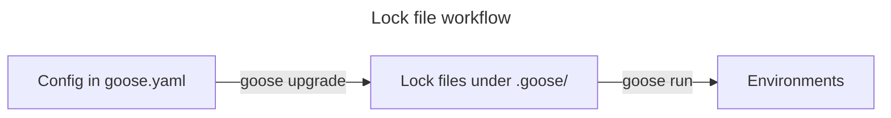

<!-- prettier-ignore-start -->
<!-- https://github.com/prettier/prettier/issues/15479 -->

> [!NOTE]
> This project is in its infancy. Please try it out and report and help fix any issues or missing features, but expect a somewhat broken experience.
>
> Breaking CLI changes is to be expected without notice between arbitrary versions until version 1.0 is released.

<!-- prettier-ignore-end -->

<h1 align=center>goose<br>🦆🧪💻</h1>

<p align=center>A <i>picky</i> and <i>eager</i> <a href=https://git-scm.com/book/en/v2/Customizing-Git-Git-Hooks>Git hook</a> runner.</p>

- 🔒 Reproducible builds.
- ⚡ Dynamic parallelism.
- 💨 Small file-system footprint.
- 🏃 Fast Python environmnent and dependency management thanks to [uv].

[uv]: https://github.com/astral-sh/uv

### Installation

#### Via PyPI

```shell
pip install --require-venv git-goose
```

#### Via uvx

```shell
uvx install git-goose
```

#### Via pipx

```shell
pipx install git-goose
```

#### Docker alias

```sh
alias goose='docker run --rm -it -v ${PWD}:/wd -v ~/.cache/goose-docker:/home/nonroot/.cache -e "GOOSE_AUGMENTED_CWD=${PWD}" ghcr.io/antonagestam/goose:latest'
```

#### Github Actions

```yaml
name: CI
on:
  push:
    branches: ["main"]
  pull_request:
jobs:
  lint:
    name: Run goose checks
    uses: antonagestam/goose/.github/workflows/run.yaml@main
```

### Features

- Smart parallelism schedules hooks across CPUs while avoiding concurrent writes.
- Deterministic environments by using ecosystem-specific lock files.
- Environments are shared across hooks.
- Self-contained definitions means there's no need to push tool-specific configuration
  upstream, or to maintain brittle mirroring schemes.

### Parallelism

Goose takes care to keep your CPUs as busy as possible, optimizing to have the full
suite of hooks finish as soon as possible. It does this by distributing units of work to
all available processing cores.

Parameterized hooks, or hooks that take files as command line arguments, are divided to
one unit of work per available core. Whenever a core becomes available for more work, a
new unit is chosen for execution.

The scheduler takes care to never run more than one mutating hook on the same file. It
does this by taking into account hooks marked as `read_only` and by comparing sets of
files a unit of work is assigned to. Two incompatible hooks can be simultaneously
working on two separate parts of the code-base.

### Deterministic environments

Goose uses lock files to facilitate deterministic results across developer environments
and CI. You specify dependencies in `goose.yaml`, and invoking `goose run` will produce
the appropriate lock files under a `.goose/` directory. The `.goose/` directory is meant
to be checked into git, so that future invocations of `goose run` can use the lock files
it contains to produce identical environments for hooks to run in.



- Invoking `goose upgrade` creates lock files under the in-tree `.goose` directory.
- Invoking `goose run` creates out-of-tree environments from the lock files. By default
  they live under `~/.cache/goose`.
- Hooks are executed in the generated environments.

## Usage

Create a `goose.yaml` file in the repository root.

```yaml
environments:
  - id: python
    ecosystem:
      language: python
      version: "3.13"
    dependencies:
      - ruff

hooks:
  - id: ruff
    environment: python
    command: ruff
    args: [check, --force-exclude, --fix]
    types: [python]

  - id: ruff-format
    environment: python
    command: ruff
    args: [format, --force-exclude]
    types: [python]
```

Bootstrap environments, generate lock files, and install dependencies.

```sh
$ goose upgrade
```

Run all hooks over all files.

```sh
$ goose run --select=all
```

Commit configuration and lock files.

```sh
$ git add goose.yaml .goose
$ git commit -m 'Add goose configuration'
```

### Upgrading hook versions

As pinning of hook versions is handled with lock files, there's no need to change
configuration to upgrade hook dependency versions, instead you just run the upgrade
command.

```sh
$ goose upgrade
$ git add .goose
$ git commit -m 'Bump goose dependencies'
```

### Example node hook

Goose currently supports Python and Node environments, here's an example using
[Prettier] to format Markdown files.

[Prettier]: https://prettier.io/

```yaml
environments:
  - id: node
    ecosystem:
      language: node
      version: "21.7.1"
    dependencies:
      - prettier

hooks:
  - id: prettier
    environment: node
    command: prettier
    types: [markdown]
    args:
      - --write
      - --ignore-unknown
      - --parser=markdown
      - --print-width=88
      - --prose-wrap=always
```

### Read-only hooks

You will likely want to use a mix of pure linters, as well as formatters and
auto-fixers. Tools that don't mutate files can be more heavily parallelized by Goose,
because they can inspect overlapping sets of files simultaneously as other tools. To
enable this you set `read_only: true` in hook configuration.

```yaml
environments:
  - id: python
    ecosystem:
      language: python
      version: "3.13"
    dependencies:
      - pre-commit-hooks

hooks:
  - id: check-case-conflict
    environment: python
    command: check-case-conflict
    read_only: true

  - id: check-merge-conflict
    environment: python
    command: check-merge-conflict
    read_only: true
    types: [text]

  - id: python-debug-statements
    environment: python
    command: debug-statement-hook
    read_only: true
    types: [python]

  - id: detect-private-key
    environment: python
    command: detect-private-key
    read_only: true
    types: [text]

  - id: end-of-file-fixer
    environment: python
    command: end-of-file-fixer
    types: [text]

  - id: trailing-whitespace-fixer
    environment: python
    command: trailing-whitespace-fixer
    types: [text]
```

Hooks that do not specify `read_only: true` will never run simultaneously as other tools
over the same file.

### Non-parameterized hooks

Some tools don't support passing files, or just work better if given the responsibility
to parallelize work itself. One such tool is mypy. You can instruct goose to not pass
filenames to a hook (and as a consequence, also not spawn multiple parallel jobs for
this hook).

```yaml
environments:
  - id: mypy
    ecosystem:
      language: python
      version: "3.13"
    dependencies:
      - mypy

hooks:
  - id: mypy
    environment: mypy
    command: mypy
    read_only: true
    parameterize: false
```

### Environment variables

Hook invocations are called with the same environment variables as `goose` is invoked
with, other than `PATH` being overridden to point at the environment of the hook.

Static environment variables can be configured in hook definitions. These will overwrite
inherited values, but cannot overwrite `PATH`.

```yaml
hooks:
  - id: mypy
    environment: type-check
    command: mypy
    env_vars:
      FORCE_COLOR: "1"
    read_only: true
    parameterize: false
```
